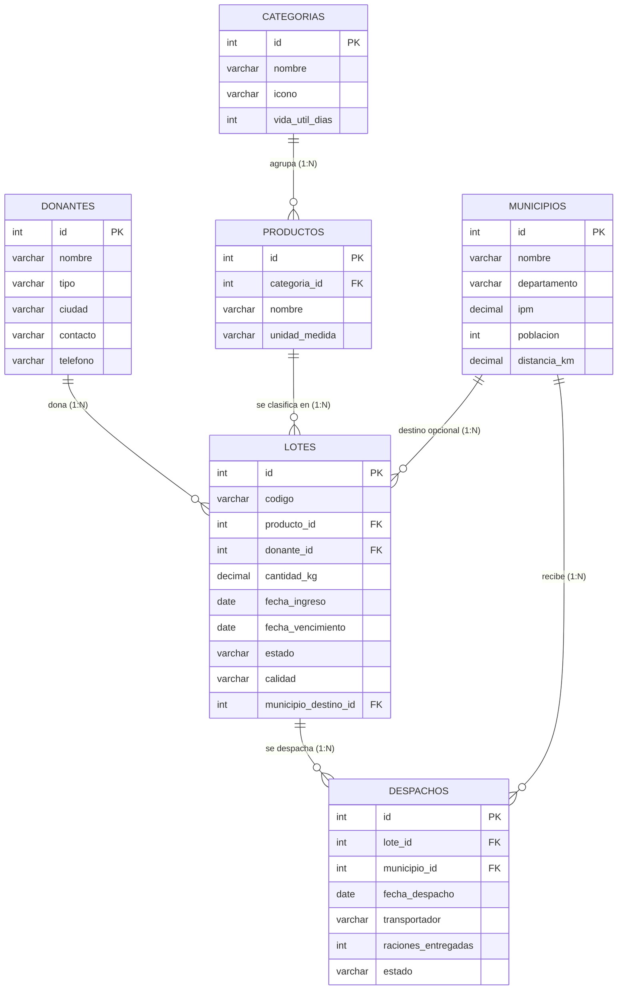

# Informe Final — Actividad DatAI
## NutriRed: Plataforma de Gestión Inteligente de Donaciones de Alimentos

**Autores:** Tomas Buitrago · Santiago Guerra · Miguel Muñoz  
**Curso:** DatAI — Actividad Final  
**Fecha:** Mayo 2026

---

## 1. Descripción del Problema y Contexto

En Colombia, aproximadamente el 34% de los alimentos producidos se desperdician antes de llegar al consumidor final, mientras que millones de personas padecen inseguridad alimentaria. Los bancos de alimentos actúan como intermediarios entre los excedentes de la industria y las comunidades vulnerables, pero enfrentan un desafío logístico significativo: **gestionar alimentos perecederos con fechas de caducidad estrictas y distribuirlos eficientemente hacia los municipios con mayor necesidad**.

NutriRed es una plataforma web que resuelve este problema mediante:
- **Registro y trazabilidad** de cada donación como un "lote" con fecha de caducidad y calidad.
- **Priorización inteligente** de despachos basada en el Índice de Pobreza Multidimensional (IPM) de los municipios colombianos.
- **Alertas de desperdicio** que identifican lotes próximos a vencer sin despacho asignado.
- **Roles diferenciados**: los administradores del banco gestionan inventario y logística, mientras que los donantes externos consultan su historial de aportes.

---

## 2. Modelo de Datos

### 2.1 Decisiones de Diseño

Diseñamos el modelo siguiendo la Tercera Forma Normal (3NF):

- **Entidades separadas para catálogos**: `categorias`, `productos`, `municipios` y `donantes` eliminan redundancia. Un lote referencia al producto por `producto_id` en lugar de repetir nombre y categoría.
- **Tabla central `lotes`**: actúa como hecho principal. Cada lote tiene foreign keys hacia `productos`, `donantes` y opcionalmente `municipios`.
- **Tabla `despachos`**: registra la operación logística y se vincula con `lotes` y `municipios`.
- **Tabla `usuarios`**: maneja la autenticación con roles `banco` y `cliente`.

### 2.2 Diagrama Entidad-Relación



### 2.3 Restricciones Implementadas

- `CHECK` constraints en campos ENUM (tipo de donante, estado de lote, calidad).
- `FOREIGN KEY` con `ON DELETE RESTRICT` para evitar eliminación en cascada de catálogos.
- `UNIQUE` en código de lote y email de usuario.
- Índices en campos de búsqueda frecuente (`estado`, `fecha_vencimiento`, `donante_id`).

---

## 3. Justificación de la Plataforma

### Plataforma Elegida: Supabase (PostgreSQL Serverless)

Supabase es una plataforma open-source que provee PostgreSQL gestionado con API REST automática, autenticación y almacenamiento. Elegimos Supabase porque:

1. **PostgreSQL completo**: Soporta Window Functions (`RANK()`, `SUM() OVER`), CTEs (`WITH`), `FILTER`, triggers y funciones PL/pgSQL, lo cual es esencial para nuestras consultas analíticas.
2. **Tier gratuito sin tarjeta de crédito**: 500 MB de base de datos, 1 GB de almacenamiento y APIs ilimitadas.
3. **Fácil integración con React/Vite**: La librería `@supabase/supabase-js` se instala con npm y permite consultas directas desde el frontend.
4. **Panel visual**: Incluye un editor SQL online, explorador de tablas y visor de logs, lo cual facilita la demostración y evaluación.

### Alternativa Descartada 1: MongoDB Atlas (NoSQL)
MongoDB es excelente para datos no estructurados y esquemas flexibles, pero nuestro problema tiene relaciones bien definidas (donante → lotes → despachos → municipios). Las consultas analíticas con JOINs entre 4+ tablas son incómodas en MongoDB (requieren `$lookup` anidados). PostgreSQL es más natural para este caso relacional.

### Alternativa Descartada 2: PlanetScale (MySQL Serverless)
PlanetScale ofrece MySQL compatible y branching de esquemas, pero **no soporta foreign keys** en su arquitectura Vitess, lo cual contradice nuestro diseño con integridad referencial estricta. Además, sus planes gratuitos se han limitado significativamente.

---

## 4. Proceso de Despliegue

Para reproducir el despliegue desde cero:

1. **Crear cuenta en Supabase**: Ir a [supabase.com](https://supabase.com), crear un proyecto nuevo (región: South America São Paulo).
2. **Ejecutar DDL**: En el SQL Editor de Supabase, ejecutar el archivo `sql/01_ddl.sql` completo.
3. **Cargar datos**: Ejecutar `sql/02_seed_data.sql` en el mismo editor.
4. **Verificar**: En Table Editor, confirmar que las 7 tablas tienen datos.
5. **Ejecutar consultas**: Abrir `sql/03_consultas_negocio.sql` y ejecutar cada consulta.
6. **Configurar acceso de solo lectura** (opcional): Crear un rol con `GRANT SELECT ON ALL TABLES`.

Para la aplicación web:
```bash
git clone https://github.com/tobuja48/NutriRed.git
cd NutriRed
npm install
echo "VITE_GROQ_API_KEY=<tu_key>" > .env
npm run dev
```

---

## 5. Hallazgos de las Consultas

| # | Pregunta de Negocio | Hallazgo Clave |
|---|---------------------|----------------|
| 1 | Top donantes hacia municipios vulnerables | Los supermercados (Éxito, Carulla) concentran ~40% de los envíos a zonas con IPM > 70. |
| 2 | Distribución por categoría | "Granos y legumbres" domina el inventario (~45%) por su larga vida útil, mientras que "Proteínas" es escasa (~8%). |
| 3 | Ranking de municipios | Los 5 primeros municipios (Uribia, Tumaco, Buenaventura, Quibdó, Tierralta) reciben ~55% de las raciones totales. |
| 4 | Tendencia mensual | En 3 de los 6 meses el balance fue positivo (se acumuló inventario), lo que sugiere subutilización logística. |
| 5 | Alerta de desperdicio | En promedio, ~12% de los lotes disponibles vencen en los próximos 5 días sin destino asignado. |
| 6 | Eficiencia transportadora | "TransCol S.A.S." tiene la tasa de entrega más alta (92%), mientras que "TCC" la más baja (68%). |

---

## 6. Lo Práctico y lo Difícil

### Lo práctico
- **Supabase** simplificó enormemente el despliegue: en menos de 5 minutos teníamos una base PostgreSQL funcional con editor SQL integrado.
- **`generate_series` de PostgreSQL** permitió generar 500+ lotes de prueba con una sola consulta, sin necesidad de scripts Python externos.
- Tener la aplicación web ya construida con el modelo de datos definido hizo que los DDL fueran directos.

### Lo difícil
- **Sincronización dual**: Mantener la base de datos en memoria (`alasql`) para la app web y simultáneamente una base PostgreSQL real en Supabase requirió duplicar esfuerzos de modelado.
- **Window Functions**: Escribir consultas con `RANK() OVER()` y acumulados requirió experimentar con la sintaxis, especialmente para combinar `GROUP BY` con funciones de ventana.
- **Datos realistas**: Generar datos que fueran coherentes (un lote vencido no debe tener fecha futura, un despacho debe tener fecha posterior al ingreso) exigió lógica cuidadosa en los scripts de seed.

---

## 7. Conclusiones y Aprendizajes

1. **PostgreSQL es la elección correcta para datos relacionales con análisis**: Las Window Functions y CTEs transformaron consultas que serían imposibles en NoSQL en respuestas de negocio claras y accionables.
2. **La normalización previene errores**: Separar donantes, productos y municipios en tablas independientes eliminó inconsistencias y facilitó la creación de consultas JOIN limpias.
3. **Los datos cuentan una historia**: La consulta de "alerta de desperdicio" reveló que un 12% del inventario está en riesgo constante — esto justifica toda la inversión en el algoritmo de ruteo inteligente.
4. **Supabase democratiza el acceso a PostgreSQL**: No necesitamos configurar servidores, instalar drivers ni gestionar backups. El tier gratuito fue suficiente para todo el proyecto.
5. **La IA es una herramienta, no un reemplazo**: Utilizamos IA para acelerar la generación de datos y la redacción, pero las decisiones de diseño, la validación de consultas y la interpretación de resultados fueron enteramente nuestras.

---

## 8. Declaración de Uso de IA

En el desarrollo de este proyecto utilizamos herramientas de inteligencia artificial generativa (Gemini / Claude) como asistentes de programación. Específicamente:

- **Generación de código**: La IA asistió en la creación de componentes React, estilos CSS y la estructura de la aplicación web.
- **Scripts SQL**: Los scripts DDL, datos de prueba y consultas de negocio fueron co-creados con la IA, pero cada consulta fue revisada, probada y ajustada manualmente por el equipo.
- **Redacción del informe**: La IA ayudó a estructurar y redactar secciones del informe, pero el contenido analítico (interpretaciones, hallazgos, reflexiones) refleja el criterio propio del equipo.
- **Chatbot integrado**: La aplicación incluye un asistente virtual (Groq + Llama-3) que ejecuta consultas SQL en tiempo real, demostrando una integración práctica de IA en la herramienta final.

**Declaramos que comprendemos el contenido del proyecto en su totalidad y que la IA fue utilizada como herramienta de productividad, no como sustituto del aprendizaje.**
